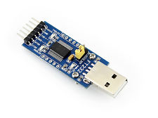
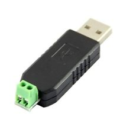

# Talking to RS485 soil moisture sensor from Raspberry Pi

This tutorial will guide you how to get soil moisture and temperature readings from Chirp RS485 soil moisture sensor. These instructions are written with RaspberryPi in mind, but actually are valid for every python installation on Windows, Linux or OSX.

## What is RS485? Modbus?

RS485 is a standard defining the electrical characteristics for use in serial communications systems. It is a vary robust protocol allowing multiple devices on the same wire and long cable runs. Cable with at least 4 conductors is used to connect the sensors. You can hook up over 200 sensors on the same bus.

Modbus is a proven, industry standard protocol that goes over RS485 signalling layer. Communication happens between one master and multiple slaves. Each slave has to have a unique address. Master can read and write configuration and data registers of slave. Framing and data integrity is taken care of.

### USB - to - RS485 dongles

To talk to the sensor you will need a dongle that allows you computer to talk and listen on the RS485 network. Luckily RS485 is so popular that there is multitude of cheap dongles to choose from on ebay. Just enter "USB RS485" into the search terms and you will get a lot to choose from. Below are some examples that work fine. For convenience, choose one that has power pins +5V and GND broken out on the connector. Also you can hack the dongle by soldering wires to such points on the board.






### Wiring the connections

The sensor has 4 connections:

 * VCC - positive power supply. Apply 5V to this pin.
 * RS485-A - noninverting line of RS485 bus
 * RS485-B - inverting line of RS485
 * GND - negative power supply  

## Installing required software

Python environment and a chirp_modbus library is needed to communicate with the sensor.

To install all the needed Pytho infrastructure, type: 

```
sudo apt-get install python-pip
```

To install the chirp_modbus Python library type:

```
sudo pip install chirp_modbus
```

BAM! You are ready to go!

## Connecting to RS485 network

USB to RS485 dongle is really a simple device - it is just a simple USB to serial adapter plus a special RS485 transceiver chip. This means, that when you insert the dongle into your computer, a serial port will be created by your operating system. In Linux and OS X this happens automagically, but in Windows you will need to download the driver for the particular UST to serial chip used in your dongle. My example dongle uses CP2102.

Enter this command before inserting the dongle into Raspberry Pi: 
```
tail -f /var/log/syslog
```

Then insert the dongle. Something like this will appear:

```
Aug 30 20:37:01 raspberrypi kernel: [  839.161890] usb 1-1.2: new full-speed USB device number 4 using dwc_otg
Aug 30 20:37:01 raspberrypi kernel: [  839.297949] usb 1-1.2: New USB device found, idVendor=10c4, idProduct=ea60
Aug 30 20:37:01 raspberrypi kernel: [  839.297973] usb 1-1.2: New USB device strings: Mfr=1, Product=2, SerialNumber=3
Aug 30 20:37:01 raspberrypi kernel: [  839.297985] usb 1-1.2: Product: CP2102 USB to UART Bridge Controller
Aug 30 20:37:01 raspberrypi kernel: [  839.297995] usb 1-1.2: Manufacturer: Silicon Labs
Aug 30 20:37:01 raspberrypi kernel: [  839.298005] usb 1-1.2: SerialNumber: 0001
Aug 30 20:37:01 raspberrypi mtp-probe: checking bus 1, device 4: "/sys/devices/platform/soc/20980000.usb/usb1/1-1/1-1.2"
Aug 30 20:37:01 raspberrypi mtp-probe: bus: 1, device: 4 was not an MTP device
Aug 30 20:37:01 raspberrypi kernel: [  839.474676] usbcore: registered new interface driver usbserial
Aug 30 20:37:01 raspberrypi kernel: [  839.474812] usbcore: registered new interface driver usbserial_generic
Aug 30 20:37:01 raspberrypi kernel: [  839.474941] usbserial: USB Serial support registered for generic
Aug 30 20:37:01 raspberrypi kernel: [  839.489032] usbcore: registered new interface driver cp210x
Aug 30 20:37:01 raspberrypi kernel: [  839.489190] usbserial: USB Serial support registered for cp210x
Aug 30 20:37:01 raspberrypi kernel: [  839.489396] cp210x 1-1.2:1.0: cp210x converter detected
Aug 30 20:37:01 raspberrypi kernel: [  839.523446] usb 1-1.2: cp210x converter now attached to ttyUSB0
Aug 30 20:38:50 raspberrypi systemd[1]: Starting Cleanup of Temporary Directories...
Aug 30 20:38:51 raspberrypi systemd[1]: Started Cleanup of Temporary Directories.
```

This line is of importance here:

```
Aug 30 20:37:01 raspberrypi kernel: [  839.523446] usb 1-1.2: cp210x converter now attached to ttyUSB0
```

This means, the dongle now is accessible via /dev/ttyUSB0 serial port. Now it's time to write some code.

## Connecting to the sensor

From the command line start the Python interpreter:

```
$ python
```

You will be welcomed by Python interpreter:

```
$ python
Python 2.7.13 (default, Jan 19 2017, 14:48:08) 
[GCC 6.3.0 20170124] on linux2
Type "help", "copyright", "credits" or "license" for more information.
>>>
```

Type these commands:

```python
>>> import chirp_modbus
>>> sensor = chirp_modbus.SoilMoistureSensor(address=1, serialport='/dev/ttyUSB0')
>>> sensor.getMoisture()
201
```

BAM! You have just read moisture from the sensor! Try reading from the different register:

```python
>>> sensor.getTemperature()
20.0
```

Read the [source code](https://github.com/Miceuz/rs485-moist-sensor/blob/master/utils/lib/chirp_modbus.py) of the library for more.

## Addressing the sensors
All the sensors come with the same address preprogrammed to them, it's address **1**. Before using several sensors on the same bus, you have to assign unique address to each sensor. Luckily, this is just a matter of writing the address to the special Holding register:
```python
>>>sensor.setAddress(42)
```
This will set the address of the sensor to **42**. Sensor will reset and will listen on the new address immediately.

## Useful utilities
```python
#!/usr/bin/python

"""Waits for the sensor to appear on /dev/ttyUSB0, then reads moisture and temperature from it continuously"""

import chirp_modbus
from time import sleep

ADDRESS = 1

while True:
	try:
		sensor = chirp_modbus.SoilMoistureSensor(address=ADDRESS, serialport='/dev/ttyUSB0')
		# sensor.sensor.debug=True
		print(" Moisture=" + str(sensor.getMoisture()) +
			  " Temperature=" + str(sensor.getTemperature()))
		sleep(0.1)
	except (IOError, ValueError):
		print("Waiting...")
		sleep(0.3)
```

Address manipulation example:

```python
#!/usr/bin/python

"""Looks for sensor with ADDRESS1 and changes it's address to ADDRESS2 then changes it back to ADDRESS1""" 

import chirp_modbus
from time import sleep
ADDRESS1 = 1
ADDRESS2 = 2

sensor = chirp_modbus.SoilMoistureSensor(address=ADDRESS1, serialport='/dev/ttyUSB0')

print("writing new address: " + str(ADDRESS2))
sensor.setAddress(ADDRESS2)

sleep(0.2)
print("reading address from holding register: ")
print(sensor.getAddress())

print("writing new address: " + str(ADDRESS1))
sensor.setAddress(ADDRESS1)

sleep(0.2)

print("reading address from holding register: ")
print(sensor.getAddress())
```

Bus discovery example:
```python
import chirp_modbus

found = SoilMoistureSensor.scanBus(verbose=True, findOne=True, startAddress = 1, endAddress = 247)
```

### Bonus - pushing data to the Thingspeak

If you want to push your data to Thingspeak cloud, here is what you have to do.

Download thingspeak Python library:

```
$sudo pip install thingspeak
```
Set up your streak in [thingspeak.com](https://thingspeak.com)
Use this utility:

```python
#!/usr/bin/python
import chirp_modbus
from time import sleep, time
import thingspeak

channel = thingspeak.Channel(302723, api_key='YOUR API KEY', write_key='YOUR WRITE KEY')

SENSOR_PORT = '/dev/ttyUSB0'
ADDRESS = 1

sensor = chirp_modbus.SoilMoistureSensor(address=ADDRESS, serialport=SENSOR_PORT)

lastPostTimestamp = time()

moisture = 0
temperature = 0

while True:
	if time() - lastPostTimestamp > 3:
		try:
			moisture = sensor.getMoisture()
			temperature = sensor.getTemperature()
			try:
				channel.update({'field1':moisture, 'field2':temperature})
			except:
				print("#could not post")
			print(moisture, temperature)
		except(IOError, ValueError):
			print("#could not read sensor")
		
		lastPostTimestamp = time()

```


That's it folks! Please provide me feedback and send me pull requests!
